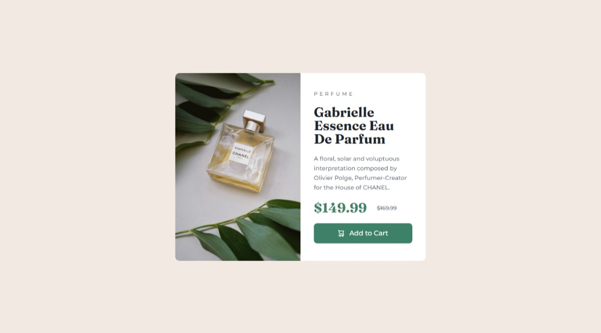

# Frontend Mentor - Product preview card component solution

This is a solution to the [Product preview card component challenge on Frontend Mentor](https://www.frontendmentor.io/challenges/product-preview-card-component-GO7UmttRfa).

## Table of contents

- [Overview](#overview)
  - [The challenge](#the-challenge)
  - [Screenshot](#screenshot)
  - [Links](#links)
- [My process](#my-process)
  - [Built with](#built-with)
- [Author](#author)

## Overview

### The challenge

Users should be able to:

- View the optimal layout depending on their device's screen size
- See hover and focus states for interactive elements

### Screenshot

### Links

- Solution URL: [View](https://www.frontendmentor.io/solutions/product-preview-card-using-htmlscss-KR9Jdy3F1N)
- Live Site URL: [View](https://product-preview-card-component-zeta.vercel.app/)

## My process

### Built with

- HTML5
- SCSS
- Flexbox

## Author

- Website - [Sebastian Canales](https://www.your-site.com)
- Frontend Mentor - [@scanales01](https://www.frontendmentor.io/profile/scanales01)
